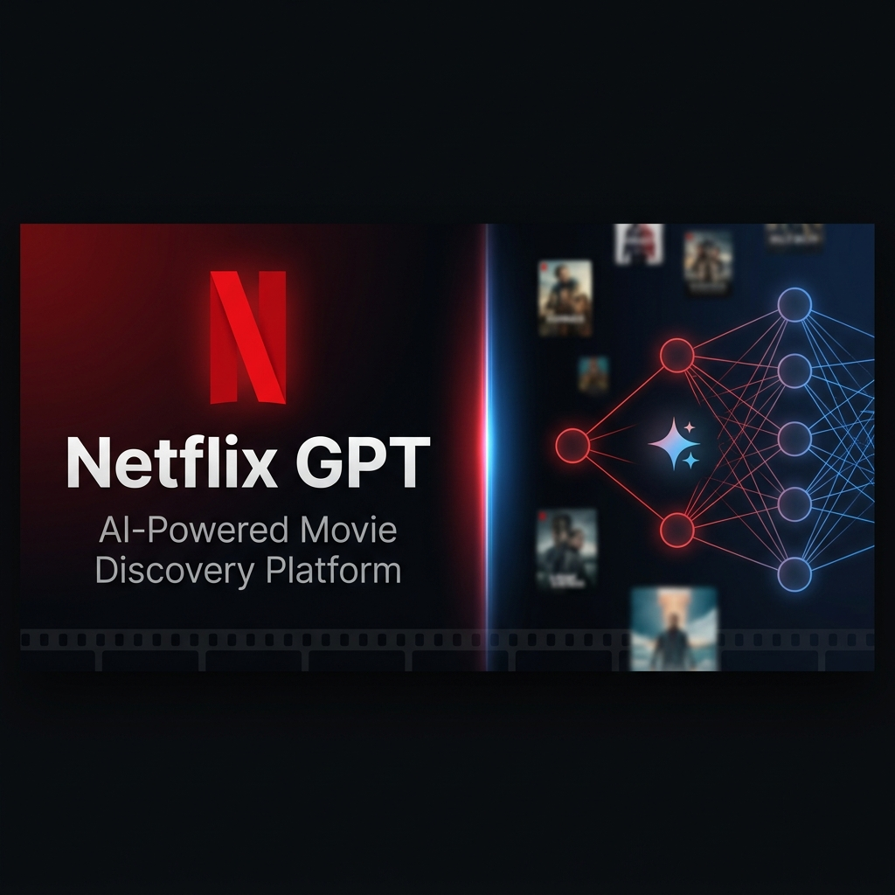
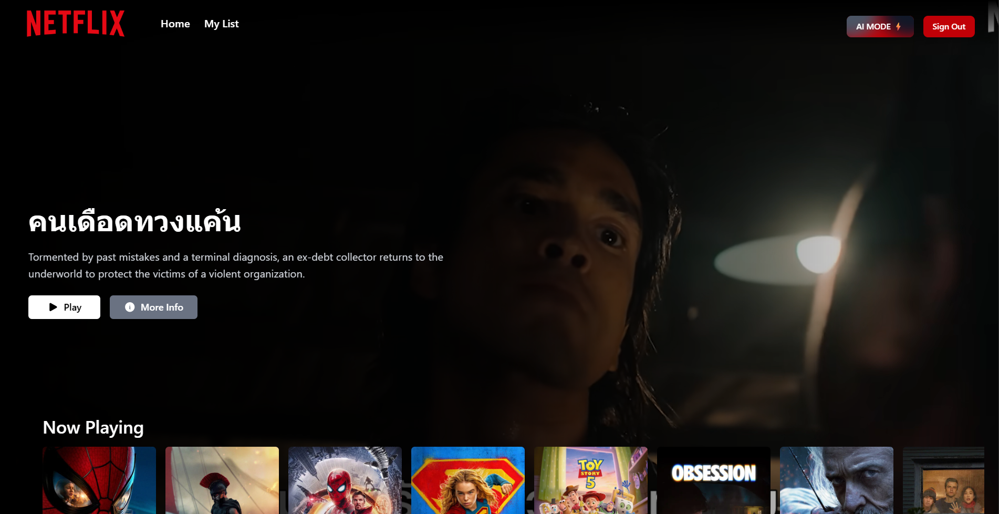
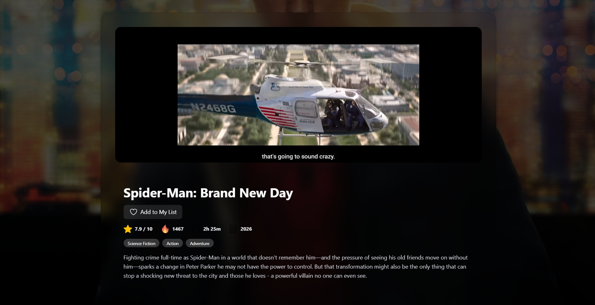
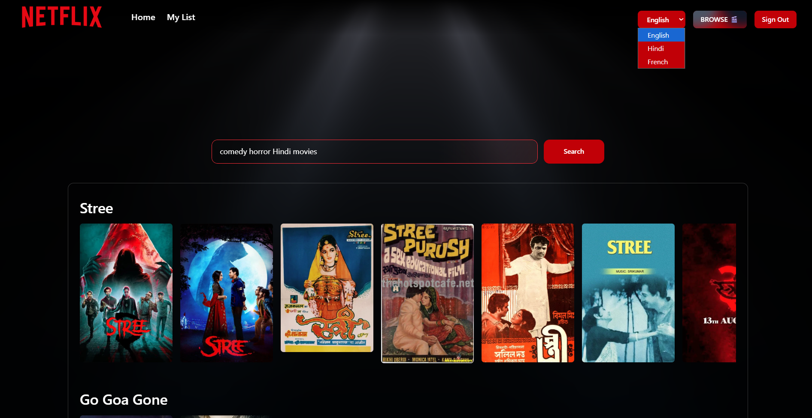
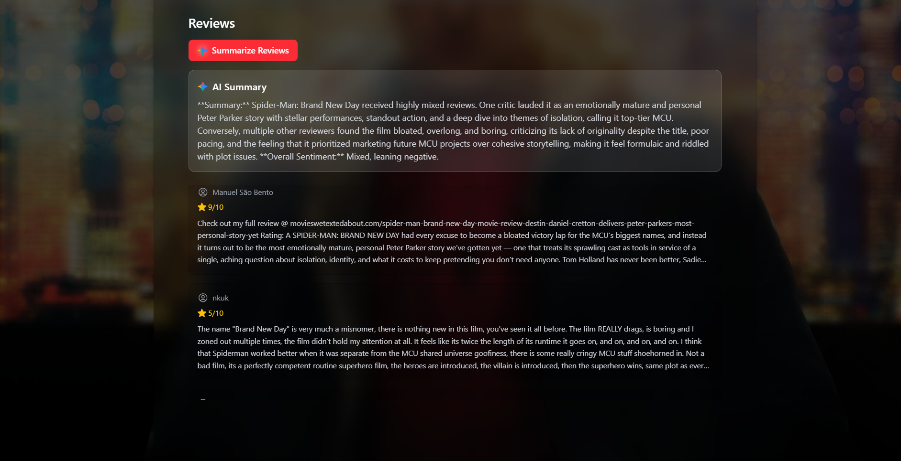

<div align="center">



<br/>

# 🎬 Netflix GPT

### An AI-Powered Movie Discovery Platform

[](https://reactjs.org/)
[](https://vitejs.dev/)
[](https://tailwindcss.com/)
[](https://redux-toolkit.js.org/)
[](https://firebase.google.com/)
[](https://ai.google.dev/)

<br/>

[](https://netflix-gpt-phi-mocha.vercel.app/)

</div>

---

## 📖 About The Project

**Netflix GPT** is a full-stack movie discovery platform that replicates the Netflix experience and enhances it with **Gemini AI**. Users can browse trending movies, get personalized AI-powered recommendations in multiple languages, view detailed movie information, read AI-summarized reviews, and save their favorite films to a personal list.

Built entirely from scratch using modern React ecosystem tools — no templates, no starters.

---

## ✨ Features

| Feature | Description |
|---|---|
| 🔐 **Authentication** | Email/Password Sign In & Sign Up via Firebase Auth |
| 🎥 **Hero Trailer** | Auto-playing muted YouTube trailer for a random now-playing movie |
| 🤖 **AI Movie Search** | Describe what you want — Gemini AI suggests 5 movies, matched via TMDB |
| 🌐 **Multi-Language** | Search prompt UI in English, Hindi, and French |
| 🎬 **Movie Detail Page** | Trailer, cast, genres, ratings, runtime, overview |
| 💬 **AI Review Summary** | Gemini reads up to 5 reviews and generates a 2–3 line sentiment summary |
| ❤️ **My List** | Save and manage your personal watchlist |
| 🎞️ **Recommendations** | Similar movies suggested on every detail page |
| ✨ **Shimmer Loading** | Skeleton loaders while content fetches |
| 📱 **Fully Responsive** | Optimized for desktop and mobile |

---

## 🖼️ Screenshots

### 🏠 Home Page
> Live trailer playing in the background with movie rows below



---

### 🎬 Movie Detail Page
> Full movie info — trailer, cast, genres, rating, runtime & overview



---

### 🤖 AI Mode — Gemini Movie Search
> Type anything natural like *"comedy horror Hindi movies"* and get real results



---

### 💬 AI Review Summary
> Click **Summarize Reviews** and Gemini gives a 2–3 line summary with sentiment



---

### ❤️ My List
> Your personal saved movie collection


---

## 🏗️ Architecture

```
src/
├── main.jsx               → React entry point
├── App.jsx                → Redux Provider wrapper
├── index.css              → Global styles + animations
│
├── componets/             → All UI Components
│   ├── Body.jsx           → Router (4 routes)
│   ├── Header.jsx         → Navbar + Firebase auth listener
│   ├── Login.jsx          → Sign In / Sign Up form
│   ├── Browse.jsx         → Browse page (Normal or AI mode)
│   ├── MainContainer.jsx  → Hero section (random movie)
│   ├── VideoBackground.jsx→ Muted YouTube trailer iframe
│   ├── VideoTitle.jsx     → Title overlay + action buttons
│   ├── SecondaryContainer.jsx → All 4 movie category rows
│   ├── MoviesList.jsx     → Horizontal scrollable row
│   ├── MoviesCard.jsx     → Single movie poster card
│   ├── MovieDetails.jsx   → Full movie detail page
│   ├── MyList.jsx         → User's saved movie list
│   ├── GptContainer.jsx   → AI mode container
│   ├── GptSearchBar.jsx   → Gemini-powered search
│   ├── GptMovieSuggetion.jsx → AI result rows
│   ├── LightRays.jsx      → WebGL animated background
│   ├── ShimmerMovieDetails.jsx → Skeleton loader
│   └── ShimmerSummary.jsx → AI summary loader
│
├── hooks/                 → Custom Data Fetching Hooks
│   ├── useNowPlayingMovies.jsx
│   ├── usePopularMovies.jsx
│   ├── useTopRatedMovies.jsx
│   ├── useUpcomingMovies.jsx
│   └── useMovieTrailer.jsx
│
└── utils/                 → Redux Store + Utilities
    ├── appStore.jsx        → Redux store (5 slices)
    ├── userSlice.jsx       → Auth state
    ├── moviesSlice.jsx     → Movie categories + trailer
    ├── gptSlice.jsx        → AI search state
    ├── languageSlice.jsx   → UI language
    ├── myListSlice.jsx     → Saved movies
    ├── firebase.jsx        → Firebase init
    ├── gemini.jsx          → Gemini AI client
    ├── constants.jsx       → API options + CDN URL
    ├── languageConstants.jsx → i18n strings
    └── Validate.jsx        → Form validation
```

---

## 🔄 App Flow

```
/ (Login)
  └── Firebase Auth
        ├── Sign Up → updateProfile → Redux Store → /browse
        └── Sign In → onAuthStateChanged → /browse

/browse
  ├── Normal Mode → Hero Trailer + 4 Movie Category Rows
  └── AI Mode     → Gemini Search Bar + Movie Results

/movie/:id
  └── Trailer + Cast + Genres + Rating + Reviews + AI Summary + Recommendations

/mylist
  └── All saved movies from Redux store
```

---

## 🛠️ Tech Stack

| Technology | Purpose |
|---|---|
| **React 19** | UI Library |
| **Vite 7** | Build tool & Dev server |
| **Tailwind CSS v4** | Styling |
| **Redux Toolkit** | Global state management |
| **React Router DOM v7** | Client-side routing |
| **Firebase Auth** | User authentication |
| **TMDB API** | Movie data & images |
| **Google Gemini 2.5 Flash** | AI movie recommendations & review summaries |
| **OGL (WebGL)** | LightRays animated background |

---

## 🚀 Getting Started

### Prerequisites
- Node.js v18+
- TMDB API key → [themoviedb.org](https://www.themoviedb.org/)
- Gemini API key → [ai.google.dev](https://ai.google.dev/)
- Firebase project → [console.firebase.google.com](https://console.firebase.google.com/)

### Installation

```bash
# 1. Clone the repository
git clone https://github.com/bikash-jha25/Netflix-GPT.git

# 2. Navigate into the project
cd Netflix-GPT-main

# 3. Install dependencies
npm install

# 4. Create your .env file
touch .env
```

### Environment Variables

Create a `.env` file in the root with:

```env
VITE_TMDB_TOKEN=your_tmdb_bearer_token_here
VITE_GEMINI_API_KEY=your_gemini_api_key_here
```

### Run Locally

```bash
npm run dev
```

Open [http://localhost:5173](http://localhost:5173) in your browser.

---

## 🤖 How Gemini AI Works In This App

### 1. Movie Recommendations (AI Mode)
```
User types: "dark thriller with mind games"
     ↓
Gemini 2.5 Flash → returns 5 movie names as CSV
     ↓
Each name searched on TMDB API
     ↓
Results displayed as movie card rows
```

### 2. AI Review Summary (Movie Detail Page)
```
User clicks "Summarize Reviews"
     ↓
Up to 5 TMDB reviews fetched
     ↓
Sent to Gemini with prompt to summarize in 2-3 lines
     ↓
Sentiment (positive/negative/mixed) displayed
```

---

## 📦 Redux Store Structure

```js
{
  user: { uid, email, displayName },      // Firebase auth user
  movies: {
    nowPlayingMovies: [...],
    popularMovies: [...],
    topRatedMovies: [...],
    upcomingMovies: [...],
    trailerVideo: { key, ... }
  },
  gpt: {
    showGptContainer: false,              // Toggle AI mode
    movieNames: [...],                    // Gemini results
    movieResults: [[...], [...], ...]     // TMDB results per movie
  },
  language: { lang: "en" },              // "en" | "hi" | "fr"
  myList: { movies: [...] }              // User's saved movies
}
```

---

## 👨‍💻 Author

**Bikash Jha**

[](https://www.linkedin.com/in/bikash-jha-4001b1292/)
[](https://github.com/bikash-jha25)

---

<div align="center">

**Built with ❤️ and a lot of ☕ — 100% hand-coded, no templates.**

</div>
